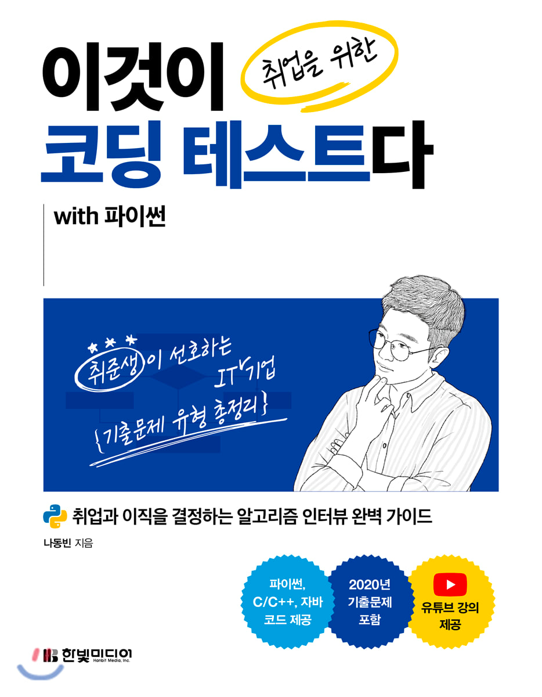

# 💡 Welcome
* 문제를 통해 알고리즘 공부하기 !
  
## ⚽️ Goal
* 기본적인 자료구조와 알고리즘의 개념을 이해한다.
* 코딩 테스트 문제를 직접 해결할 수 있다.

## 📁 Structure
```
├── algorithm
│   ├── binary_search
│   ├── dfs_bfs
│   ├── dynamic_programming
│   ├── graph
│   ├── greedy
│   ├── implementation
│   ├── short_path
│   └── sort
├── programmers
│   ├── binary_search
│   ├── dfs_bfs
│   ├── exhausive_search
│   ├── greedy
│   ├── hash
│   ├── sort
│   └── stack_queue
└── static
```

## 🔍 Reference
### 이것이 코딩 테스트다 with 파이썬 
  

No | CHAPTER |
---|---|
1 | [그리디(greedy)](https://github.com/RyuMyunggi/algorithm/tree/main/algorithm/greedy) |
2 | [구현(implementation)](https://github.com/RyuMyunggi/algorithm/tree/main/algorithm/implementation)|
3 | [DFS / BFS](https://github.com/RyuMyunggi/algorithm/tree/main/algorithm/dfs_bfs) |
4 | [정렬(sort)](https://github.com/RyuMyunggi/algorithm/tree/main/algorithm/sort) |
5 | [이진 탐색(binary_search)](https://github.com/RyuMyunggi/algorithm/tree/main/algorithm/binary_search) |
6 | [다이나믹 프로그래밍(dynamic programming)](https://github.com/RyuMyunggi/algorithm/tree/main/algorithm/dynamic_programming) |
7 | [최단 경로(sort_path)] |
8 | [그래프 이론(graph)] |

### programmers
* [바로가기](https://github.com/RyuMyunggi/algorithm/tree/main/programmers) 


